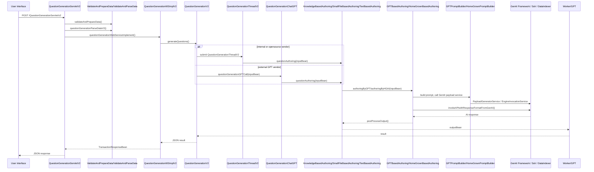

# Automated Question Authoring — Reverse Engineering Documentation

## Overview
This document captures the complete system behavior, architecture, runtime flow, and component responsibilities for the automated question generation/answering codebase present in `d:\automated_question_authoring`.

It is based on the available source in:
- `mlframework--ws/qsnauthorv2`
- `mlframework/qsnauthorv2`

The system is built as a Java EE servlet-based AI orchestration service.

---

## 1. Absolute Entry Point

### Entry point
- `QuestionGenerationServletV2` (`mlframework--ws/qsnauthorv2/QuestionGenerationServletV2.java`)
- The servlet is registered with `@WebServlet("/QuestionGenerationServlet/v2")`

### Startup flow
1. Servlet container loads and instantiates `QuestionGenerationServletV2`.
2. Field initialization occurs during construction using `ServiceLocator.instance()`:
   - `IncreaseCounterForMeteredUser`
   - `ValidateAndParseData`
   - `QuestionGenerationWSV2`
   - `ObjectMapper`
   - `ValidateAndPrepareData`
3. No Spring or explicit bootstrap class is present in this workspace.
4. The actual request processing begins in `doPost(...)`.

### Key startup dependencies
- `ServiceLocator` (external dependency)
- `MergediONMLServlet` (external runtime environment connector)
- `DbBasedLimitGuavaCacheLoaderService` (external limits/cache service)
- `CommercialVendorDetailsCacheLoader` / `UserLevelEngineSelectionService`

---

## 2. Request Lifecycle

### Sequence diagram

### Detailed request stages
1. **Frontend request**: a POST request arrives at `QuestionGenerationServletV2`.
2. **Validation**: `validateprepdata.validateAndPrepareData()` prepares `WebServiceParams`.
3. **Metering license checks**: if the request is metered, counter logic runs via `IncreaseCounterForMeteredUser`.
4. **Request parsing**: `validateparsedata.questionGenerationParseDataV2(request)` returns `TransactionRequestBean`.
5. **Service entry**: `QuestionGenerationWSImplV2.questionGenerationWebServiceImplement(...)` maps request to an internal `InputBean`.
6. **Metadata and vendor lookup**:
   - `MetadataUtility.fetchSyncMetadataFromCache(...)`
   - `DbBasedLimitGuavaCacheLoaderService.getTextLimits(...)`
   - `CommercialVendorDetailsCacheLoader` or `UserLevelEngineSelectionService`
7. **Vendor routing**: `InputBean.AIvendorCredNodeMap` determines whether to use internal/open-source or external GPT vendor.
8. **Question generation**:
   - internal/open-source path executes via `ExecutorServiceSingleTon` and `QuestionGenerationThreadV2`
   - external GPT path executes via `QuestionGenerationChatGPT`
9. **Input-type selection**:
   - `kb` -> `KnowledgeBasedAuthoring`
   - `file` -> `SmallFileBasedAuthoring`
   - default -> `TextBasedAuthoring`
10. **Retrieval**: if needed, content is retrieved from Solr or temporary runtime vector collection.
11. **Prompt construction**: `GPTPromptBuilder` or `HomeGrownPromptBuilder` build structured prompt messages.
12. **LLM call**: `GptIntegration` or `MistralIntegration` executes the external API call.
13. **Post-processing**: response is parsed into JSON arrays.
14. **Response assembly**: `OutputBean` is wrapped and returned to servlet.
15. **Response send**: the servlet serializes `TransactionResponseBean` to JSON and returns it.

---

## 3. Architecture Mapping

### Layers
- **Web/API layer**: `QuestionGenerationServletV2`
- **Validation/metering layer**: `ValidateAndPrepareData`, `ValidateAndParseData`, `IncreaseCounterForMeteredUser`
- **Service/Orchestration layer**: `QuestionGenerationWSImplV2`, `QuestionGenerationV2`
- **Worker layer**: `QuestionGenerationThreadV2`, `QuestionGenerationChatGPT`
- **Input-type layer**: `KnowledgeBasedAuthoring`, `SmallFileBasedAuthoring`, `TextBasedAuthoring`
- **AI layer**: `GPTBasedAuthoring`, `HomeGrownBasedAuthoring`
- **Prompt/template layer**: `GPTPromptBuilder`, `HomeGrownPromptBuilder`, `GPTResponseFormatBuilder`
- **Utilities/config layer**: `Utility`, `SerachTextGenerator`, `MetadataUtility`

### Component responsibility map
- `QuestionGenerationServletV2`: HTTP entry, response serialization, error capture, metering.
- `QuestionGenerationWSImplV2`: request translation, metadata enrichment, vendor selection.
- `QuestionGenerationV2`: runtime execution decision between threaded internal AI or external GPT.
- `QuestionGenerationThreadV2` / `QuestionGenerationChatGPT`: actual authoring invocation and audit log.
- `KnowledgeBasedAuthoring`: permanent KB retrieval from Solr and prompt orchestration.
- `SmallFileBasedAuthoring`: runtime file ingestion, temporary collection creation, retrieval, cleanup.
- `TextBasedAuthoring`: direct text chunking and generation.
- `GPTBasedAuthoring`: parallel per-question-type GPT call orchestration.
- `HomeGrownBasedAuthoring`: parallel per-question-type internal model orchestration.
- `GPTPromptBuilder` / `HomeGrownPromptBuilder`: template-based prompt formatting.
- `GPTResponseFormatBuilder`: JSON schema response definition by question type.
- `Utility`: shared helper functions and global property caching.
- `SerachTextGenerator`: query generation for retrieval.

### Dependency graph
- `Servlet -> Service -> Orchestrator -> Worker / ChatGPT -> InputType -> AI -> Prompt -> External Engine`
- `KnowledgeBasedAuthoring -> DataRetriever / SolrAdminClient`
- `SmallFileBasedAuthoring -> DataIndexer / SolrAdminClient`
- `TextBasedAuthoring -> Utility` for chunking
- `GPTPromptBuilder -> PayloadGeneratorService`
- `SerachTextGenerator -> EngineInvocationService`

---

## 4. Knowledge Base and Embedding Flow

### Permanent KB ingestion
- Not implemented directly in this workspace.
- The code expects a pre-built Solr collection with the name produced by `Utility.prepareCollectionName(appId, orgId, entity)`.
- `KnowledgeBasedAuthoring` verifies the collection exists via `SolrAdminClient.listCollections()`.

### Retrieval flow for KB
- Builds Solr filter on `filePath` using `buildInFilter("filePath", inputBean.getFilePaths())`.
- Generates search prompt via `SerachTextGenerator.QueryGengertor(inputBean)`.
- Calls `DataRetriever.retrieveDataFromCollection(...)` with:
  - `solrUrl`
  - `collectionName`
  - `searchText`
  - `cosineThreshold`
  - `filters`
  - `requestId`
  - `port`
- Retrieved `Chunk` list is stored in `inputBean.retrievedChunks`.

### Runtime uploaded file ingestion
- `SmallFileBasedAuthoring` handles temporary runtime file uploads.
- It validates the file and extension.
- It creates a temporary Solr collection `small_file_<collectionName>_<safeFilename>`.
- It indexes the file into Solr/vector DB via `DataIndexer.processAndSendToVectorDB(...)`.
- It queries the temporary collection with generated search text.
- If retrieval returns empty, it falls back to raw file chunking.
- If the collection was created during this request, it is deleted at the end.

### Embedding pipeline
- Invoked via `DataIndexer.processAndSendToVectorDB(...)`.
- This is the embedding generation trigger.
- Actual embedding model and storage are external; the workspace only shows orchestration.
- The temporary collection is created with any necessary Solr schema updates via `indexer.createCollectionIfNotExistsAndUpdateSchema(...)`.

### Retrieval strategy
- Uses query-based semantic search
- Similarity threshold is controlled by `MetadataBean.cosineThreshold`
- Query is generated via LLM-assisted prompt generation
- For KB retrieval, it also applies `filePath` filtering
- No explicit reranking after retrieval is visible in this workspace

---

## 5. AI Orchestration

### Prompt engineering flow
- Prompts are not hard-coded inside AI invocation classes.
- They are retrieved from an external GenAI prompt framework via `PayloadGeneratorService(questionType)`.
- `GPTPromptBuilder` and `HomeGrownPromptBuilder` then replace placeholders in the retrieved template.
- Placeholder replacement includes:
  - `{MaxQuestions}`
  - `{QuestionType}`
  - `{MaxOptions}`
  - `{quesTypeConfig}`
  - `{User Directives}`
  - `{EnableHint}`
  - `{HintDescription}`
  - `{EnableKnowMore}`
  - `{KnowMoreDescription}`
  - `{UserInstruction}`
  - `{Input Context}`

### Response format enforcement
- `GPTResponseFormatBuilder` builds strict `json_schema` wrapper objects.
- Each question type is given a schema to force structured output.
- For example, `mcq` requires:
  - `question`
  - `options`
  - `answer`
- `comprehensionmcq` builds a nested schema with `passage` and `questions`.

### Vendor selection
- If `AIvendorCredNodeMap` is missing or contains internal keys (`TCS_iON_AI_ML`, `QUESTION_GENERATION_OPENSOURCE`), the service uses homegrown model.
- Otherwise it uses GPT vendor integration.

### Model invocation
- GPT path:
  - `GPTBasedAuthoring.authoringByGPT(inputBean)`
  - calls `GptIntegration.invokeAPIwithResponseFormatFromGenAI(...)`
- Homegrown path:
  - `HomeGrownBasedAuthoring.authoringByHGAI(inputBean)`
  - calls `MistralIntegration.invokeAPIwithResponseFormatFromGenAI(...)`

### Retry / fallback
- Retry logic exists in commented code but is not active.
- Current live behavior does not retry AI calls.
- Failures are classified and aggregated per question type.

### Hallucination control
- Controlled through:
  - retrieval augmentation
  - response schema enforcement
  - prompt constraint injection
- There is no explicit hallucination reranking module present in this workspace.

---

## 6. Runtime Upload Flow

### Lifecycle
- Upload request arrives with `fileType=file`.
- `SmallFileBasedAuthoring` validates and processes the file.
- It creates a temporary Solr collection named:
  - `small_file_<collectionName>_<filename>`
- It indexes the document into Solr.
- It queries the temporary collection.
- It deletes the collection when the request completes.

### Persistence and cleanup
- Temporary collection creation is conditional.
- If an existing collection already exists, the service may reuse it.
- If newly created, it deletes the collection on completion.

### Isolation
- Runtime files are kept separate from permanent KB collections.
- The temporary collection naming and cleanup ensure runtime data does not persist indefinitely.

---

## 7. Question Generation Logic

### Supported question types
- `mcq`
- `faq`
- `truefalse`
- `msq`
- `fillblanks`
- `comprehensionmcq`

### Generation strategy
- The system generates each question type concurrently using a thread pool.
- Each question type has its own prompt and response schema.
- `questionListsByType` collects results per question type.
- `Utility.consolidateQuestionsForMultipleTypes(...)` merges and truncates results to max configured questions.

### Difficulty handling
- Difficulty is managed through prompt instructions, not explicit numeric difficulty fields.
- The prompt templates reference Bloom's Taxonomy and question complexity.
- `QuestionTypeConfig` only encodes:
  - `maxQuestions`
  - `maxOptions`
  - `enableHint`
  - `enableKnowMore`

### Deduplication and quality control
- There is no dedicated deduplication algorithm.
- Duplicate avoidance is only indirectly handled by prompt design and the `QuestionsToBeRetained` / `QuestionsToBeDiscarded` directives.
- Output assembly truncates results to max questions.

---

## 8. Key Class Reference

### API and orchestration
- `QuestionGenerationServletV2`
- `QuestionGenerationWSImplV2`
- `QuestionGenerationV2`
- `QuestionGenerationThreadV2`
- `QuestionGenerationChatGPT`

### Input type orchestration
- `KnowledgeBasedAuthoring`
- `SmallFileBasedAuthoring`
- `TextBasedAuthoring`

### AI orchestration
- `GPTBasedAuthoring`
- `HomeGrownBasedAuthoring`
- `GPTPromptBuilder`
- `HomeGrownPromptBuilder`
- `GPTResponseFormatBuilder`

### DTOs
- `InputBean`
- `QuestionTypeConfig`
- `MetadataBean`
- `OutputBean`

### Utilities
- `Utility`
- `SerachTextGenerator`
- `MetadataUtility`

---

## 9. Execution Trace and Thread Graph

### Request thread
- `doPost()` executes on servlet thread
- validation and parsing occur synchronously
- request object creation occurs on request thread

### Worker thread
- `QuestionGenerationV2` submits a worker thread if internal/open-source vendor selected
- `QuestionGenerationThreadV2.run()` executes under worker thread

### Per-question-type thread pool
- `GPTBasedAuthoring` and `HomeGrownBasedAuthoring` each create a fixed thread pool sized by number of question types
- Each prompt type executes in parallel in that thread pool
- `Future.get()` waits for completion

### Audit logging / finalization
- Both `QuestionGenerationThreadV2` and `QuestionGenerationChatGPT` log audit entries in finally blocks
- Response aggregation occurs after all futures complete

---

## 10. Configuration and Environment

### Config key sources
- `Utility.getGblGlobalProperty(...)`
- `Utility.getGblProperty(...)`
- `FetchSolarConfig.fetchAndStoreProperty(...)`
- external database tables:
  - `gblglobalproperties`
  - `gblproperties`

### Important config keys
- `ionml.dataindexer.chunk.level.context`
- `ionml.dataindexer.chunk.sentences.context`
- `ionml.dataindexer.chunk.level.<ext>`
- `ionml.dataindexer.chunk.sentences.<ext>`
- `MlFrameworkConstants.ION_SEARCH_URL`
- `MlFrameworkConstants.ION_SEARCH_NUM_OF_SHARDS`
- `MlFrameworkConstants.ION_SEARCH_NUM_OF_REPLICAS`

### Environment behavior
- Local vs prod differences are controlled by DB property values and external service configuration.
- AI vendor credentials and service IDs are loaded at runtime.
- No direct environment variable file is visible in this workspace.

---

## 11. Storage and Database

### Solr / vector store
- Permanent KB uses Solr collections named after `appId_orgId_entity`
- Runtime file ingestion uses temporary collections named `small_file_<base>_<filename>`

### Metadata storage
- `MetadataBean` values are loaded from cached metadata services.
- `QuestionTypeConfig` is built from request payloads.

### Generated content lifecycle
- Generated questions are returned in response only.
- This workspace does not persist generated questions to DB.

---

## 12. Error Handling and Resilience

### Error propagation
- `QuestionGenerationServletV2.doPost()` catches all exceptions and logs them.
- Response is still returned with `responseCode` and `responseMessage`.

### AI failure handling
- Per-question-type faults are aggregated by status code.
- If one type fails, others may still succeed.
- Return codes include partial success semantics.

### Missing resilience patterns
- no circuit breaker pattern is present in this workspace
- retries are commented out, not active
- no transaction rollback is visible

---

## 13. Security and Enterprise Concerns

### Authentication/authorization
- likely handled by external validation utilities not visible here.
- `WebServiceParams` contains license and metered user validation.

### Upload validation
- file extension validation is enforced by `Utility.validateFileExtension(...)`
- runtime file content parsing is handled by external file readers

### Prompt injection protections
- minimal; prompt templates are built from templates and placeholders.
- direct user text is inserted into prompts via replacement, so careful validation should be added if not already handled externally.

### Audit logging
- `AuditLogService.logAuditEntry(...)` is called in finally blocks.
- Timing metrics are recorded for request phases.

---

## 14. Performance and Scaling

### Bottlenecks
- External AI model call latency.
- Multi-threaded AI orchestration and nested futures.
- Temporary Solr collection creation and deletion.
- Retrieval from Solr with vector scoring.

### Scale points
- The system scales horizontally at request level via servlet container.
- The architecture supports parallel question-type generation.
- Vector store capacity and Solr cluster configuration are the main scale limits.

### Caching
- global property cache in `Utility`
- metadata cache via external service
- vendor credentials and limits via external cache loader

---

## 15. External Dependencies and Hidden Flow

### External dependencies referenced
- `ServiceLocator`
- `MergediONMLServlet`
- `PayloadGeneratorService`
- `EngineInvocationService`
- `GptIntegration`
- `MistralIntegration`
- `DataIndexer`
- `DataRetriever`
- `SolrAdminClient`
- `FetchSolarConfig`
- `DbBasedLimitGuavaCacheLoaderService`
- `UserLevelEngineSelectionService`

### Hidden flow
- A significant amount of startup, environment, and model/provider selection logic is external to this workspace.
- The code in this workspace is primarily orchestration, not the low-level AI or Solr plumbing.

---

## 16. Practical Change Points

### Safe edit zones
- Prompt placeholders in `GPTPromptBuilder` and `HomeGrownPromptBuilder`
- Response schema builder in `GPTResponseFormatBuilder`
- chunking logic in `TextBasedAuthoring`
- runtime file collection naming and cleanup in `SmallFileBasedAuthoring`
- question-type execution flow in `GPTBasedAuthoring` / `HomeGrownBasedAuthoring`

### Risky zones
- `QuestionGenerationV2` execution decision logic
- `ServiceLocator` injection and `WebServiceParams` validation path
- external vendor credential selection logic
- runtime collection deletion/cleanup flow

---

## 17. Documented Call Graph Summary

- `QuestionGenerationServletV2.doPost()`
  - `ValidateAndPrepareData.validateAndPrepareData()`
  - `ValidateAndParseData.questionGenerationParseDataV2()`
  - `QuestionGenerationWSImplV2.questionGenerationWebServiceImplement()`
    - `MetadataUtility.fetchSyncMetadataFromCache()`
    - vendor selection logic via `CommercialVendorDetailsCacheLoader` / `UserLevelEngineSelectionService`
    - `QuestionGenerationV2.generateQuestions()`
      - either `QuestionGenerationThreadV2.run()` or `QuestionGenerationChatGPT.questionGenerationGPTCall()`
        - `KnowledgeBasedAuthoring.questionAuthoring()`
        - `SmallFileBasedAuthoring.questionAuthoring()`
        - `TextBasedAuthoring.questionAuthoring()`
          - `GPTBasedAuthoring.authoringByGPT()` / `HomeGrownBasedAuthoring.authoringByHGAI()`
            - `GPTPromptBuilder` / `HomeGrownPromptBuilder`
            - `GptIntegration.invokeAPIwithResponseFormatFromGenAI()` / `MistralIntegration.invokeAPIwithResponseFormatFromGenAI()`
            - `OutputBean` returned

---

## 18. Recommended Next Document Actions

- Add a second document mapping exact external dependencies and runtime wiring if the external libraries become available.
- Extend this document with a dedicated `design-decisions` section once the full `ServiceLocator` and prompt framework are available.
- Add explicit security and prompt sanitization recommendations for the `UserInstruction` and directive path.

---

## Appendix: Important Code References

- `mlframework--ws/qsnauthorv2/QuestionGenerationServletV2.java`
- `mlframework--ws/qsnauthorv2/QuestionGenerationWSImplV2.java`
- `mlframework--ws/qsnauthorv2/QuestionGenerationV2.java`
- `mlframework--ws/qsnauthorv2/QuestionGenerationThreadV2.java`
- `mlframework--ws/qsnauthorv2/QuestionGenerationChatGPT.java`
- `mlframework/qsnauthorv2/inputtypes/KnowledgeBasedAuthoring.java`
- `mlframework/qsnauthorv2/inputtypes/SmallFileBasedAuthoring.java`
- `mlframework/qsnauthorv2/inputtypes/TextBasedAuthoring.java`
- `mlframework/qsnauthorv2/engines/GPTBasedAuthoring.java`
- `mlframework/qsnauthorv2/engines/HomeGrownBasedAuthoring.java`
- `mlframework/qsnauthorv2/prompts/GPTPromptBuilder.java`
- `mlframework/qsnauthorv2/prompts/HomeGrownPromptBuilder.java`
- `mlframework/qsnauthorv2/prompts/GPTResponseFormatBuilder.java`
- `mlframework/qsnauthorv2/util/Utility.java`
- `mlframework/qsnauthorv2/util/SerachTextGenerator.java`
